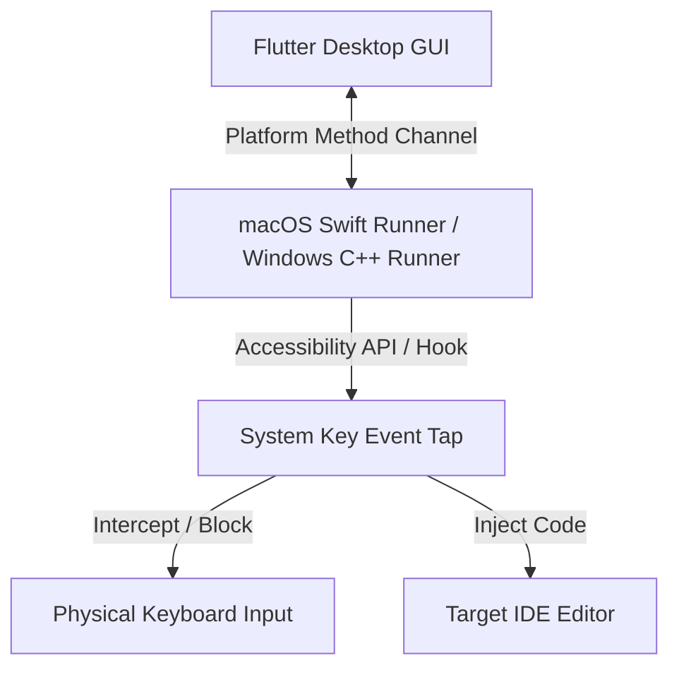

# Technical Requirement Document (TRD) - Ghost Coder

## 1. System Architecture
Ghost Coder is designed as a hybrid desktop application combining a high-level cross-platform UI framework with low-level, platform-specific system integrations.



### 1.1. Technology Stack
*   **Frontend GUI:** Flutter Desktop (macOS / Windows target configurations).
*   **macOS Core Engine:** Swift (using `CoreGraphics` & Accessibility APIs).
*   **Windows Core Engine:** C++ (using `SetWindowsHookEx` & Win32 API).
*   **Communication:** Flutter Platform Channels (MethodChannel/EventChannel).

---

## 2. Technical Specifications & Implementation

### 2.1. macOS Keyboard Interception (`CGEventTap`)
On macOS, intercepting and modifying input at a system level requires utilizing a `CGEventTap`. This tap captures input events before they reach the window server.

#### macOS Permissions
The app must request and be granted **Accessibility Permissions** (`AXIsProcessTrusted()`) in System Settings -> Privacy & Security -> Accessibility.

#### Swift Event Tap Logic
```swift
import Cocoa
import CoreGraphics

class KeyboardInterceptor {
    private var eventTap: CFMachPort?
    private var runLoopSource: CFRunLoopSource?
    private var sourceCode: String = ""
    private var currentIndex: Int = 0
    private var charsPerKeyPress: Int = 3

    func startTap() {
        let eventMask = (1 << CGEventType.keyDown.rawValue) | (1 << CGEventType.keyUp.rawValue)
        
        eventTap = CGEvent.tapCreate(
            tap: .cghidEventTap,
            place: .headInsertEventTap,
            options: .defaultTap,
            eventsOfInterest: CGEventMask(eventMask),
            callback: { (proxy, type, event, refcon) -> Unmanaged<CGEvent>? in
                let interceptor = Unmanaged<KeyboardInterceptor>.fromOpaque(refcon!).takeUnusedValue()
                return interceptor.handleEvent(proxy: proxy, type: type, event: event)
            },
            refcon: Unmanaged.passUnretained(self).toOpaque()
        )
        
        if let tap = eventTap {
            runLoopSource = CFMachPortCreateRunLoopSource(kCFAllocatorDefault, tap, 0)
            CFRunLoopAddSource(CFRunLoopGetCurrent(), runLoopSource, .commonModes)
            CGEvent.tapEnable(tap: tap, enable: true)
        }
    }
}
```

*   **Key Event Handling:**
    *   If `type == .keyDown`:
        *   Determine the virtual keycode of the pressed key.
        *   If the key is a standard typing key (alphanumeric/spaces):
            *   Block the event (return `nil` from callback).
            *   Read the next $N$ characters from the `sourceCode` buffer starting at `currentIndex`.
            *   Simulate key presses for the correct characters using `CGEvent(keyboardEventSource:source:virtualKey:keyDown:)`.
            *   Increment `currentIndex` by the number of characters injected.
        *   If the key is `Backspace`:
            *   Block the event, delete the last character in the editor, and decrement `currentIndex`.
        *   If the key is a system modifier (like `Cmd + S` or arrow keys), pass it through unmodified.

---

### 2.2. Windows Keyboard Interception (`WH_KEYBOARD_LL`)
On Windows, a low-level keyboard hook (`WH_KEYBOARD_LL`) is registered using `SetWindowsHookEx` inside the Windows Runner (C++).

#### Windows Hook Logic
```cpp
HHOOK hKeyboardHook = NULL;
std::wstring sourceCode;
int currentIndex = 0;
int charsPerKeyPress = 3;

LRESULT CALLBACK LowLevelKeyboardProc(int nCode, WPARAM wParam, LPARAM lParam) {
    if (nCode == HC_ACTION) {
        KBDLLHOOKSTRUCT* pKeyInfo = (KBDLLHOOKSTRUCT*)lParam;
        if (wParam == WM_KEYDOWN) {
            // Block normal key presses and inject corresponding sourceCode characters
            if (IsNormalKey(pKeyInfo->vkCode)) {
                InjectSourceText();
                return 1; // Block original keypress
            }
        }
    }
    return CallNextHookEx(hKeyboardHook, nCode, wParam, lParam);
}
```

*   **Keystroke Simulation:** Windows uses `SendInput` API to send simulated Unicode keyboard events directly to the active editor.

---

### 2.3. Flutter Interface & Method Channel
The Flutter application communicates configuration data and toggles state to the native runner via a `MethodChannel`.

```dart
class GhostCoderBridge {
  static const _channel = MethodChannel('com.ghostcoder.app/bridge');

  Future<void> startGhostMode({
    required String sourceCode,
    required int charsPerKeyPress,
  }) async {
    await _channel.invokeMethod('startGhostMode', {
      'sourceCode': sourceCode,
      'charsPerKeyPress': charsPerKeyPress,
    });
  }

  Future<void> stopGhostMode() async {
    await _channel.invokeMethod('stopGhostMode');
  }
}
```

---

## 3. Key Technical Challenges & Mitigations
1.  **OS Security Sandboxing:** macOS and Windows flag global keyboard hooks as high security risks.
    *   *Mitigation:* The application must guide users through enabling Accessibility Permissions on macOS, and request appropriate administrative manifests on Windows.
2.  **App Focus Detection:** Intercepting keys globally could mess up typing if the user switches out of VS Code.
    *   *Mitigation:* The native Swift/C++ runners will monitor the active focused window using `NSWorkspace.shared.frontmostApplication` (macOS) or `GetForegroundWindow` (Windows) and only apply interception if the target IDE is the active window.
3.  **Encoding & Special Characters:** Handling tabs, indentations, and carriage returns.
    *   *Mitigation:* The injector will convert carriage returns `\n` to native `Return` key events and convert tabs to spaces as configured in the editor.
